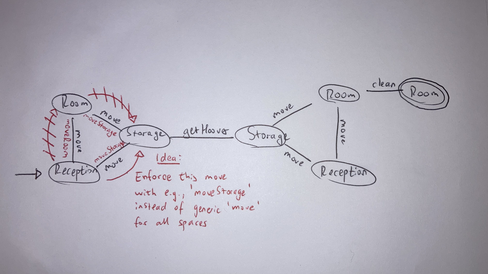

# HSG-WAS-SS23 / exercise-2

**Author**: Philipp John

**Date**: March 7, 2023

<br>

## Exercise 1)

Please see `task-1/showRoomDomain.ppdl` and `task-1/showRoomProblem.pddl`

<br>

## Exercise 2)

Please visit [https://github.com/johnphilipp/HSG-WAS-SS23-exercise-2](https://github.com/johnphilipp/HSG-WAS-SS23-exercise-2)

<br>

## Exercise 3)

### 3.1) What is the anomaly that occurs when solving the problem in the domain?

The given `t-3solution.soln` is defined as follows:

```
(move reception1 room1)
(move room1 storage1)
(gethoover storage1)
(move storage1 room1)
(cleanroom room1)
```

The anomaly is in lines 1 and 2, where the maintenance worker unnecessarily moves from reception1 to room1, and then from room1 to storage1. The fastest path would be to move directly from reception1 to storage1 (move reception1 storage1), since this is where the next action (gethoover storage1) takes place.

### 3.2) Under what circumstances does the anomaly occur?

This anomaly occurs when unnecessary state transtitions occur, i.e., when a node in a graph can be reached via two or more other nodes (paths).

### 3.3) What specifically in the problem and the domain make it susceptible?

Because of the backward search used in STRIPS, and depending on the search algorithm used, a path might be found which leads to the initial state, but takes a sub-optimal route (i.e., an intermediary state that could have been circumvented).

What could make this susceptible in the domain is that the `move` action only goes from a "generic" space to antoher "generic" space (?x - space ?y - space). We could adapt this and have a special `moveStorage` and `moveRoom` method. This would force an agent to skip the intermediary state. See image below for clarification:



### 3.4) Why is the behavior not observable with your planner implementation from Task 2?

Because unlike Enforce Hillclimb, BFS or A\* are deterministic algorithms (e.g., notice that running the same problem multiple times with `ehs` can yield different # steps). This is the difference between finding a single valid plan vs. an optimal plan.
